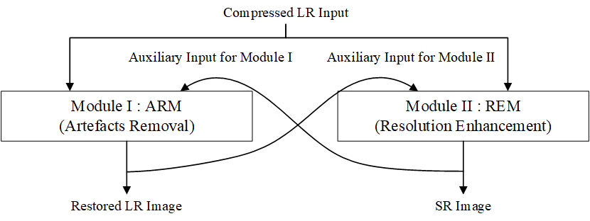
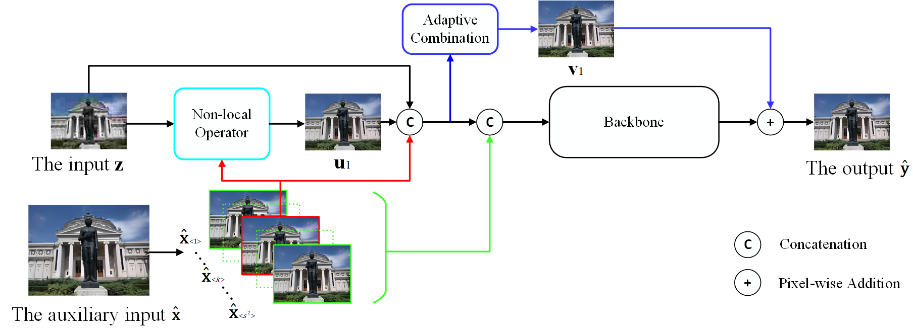
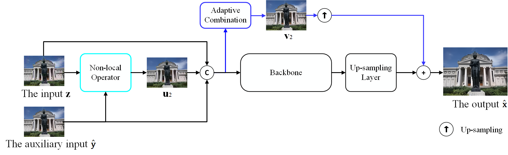

# Super-resolving Compressed Images via Parallel and Series Integration of Artifact Reduction and Resolution Enhancement 
Hongming Luo, Fei Zhou, Guangsen Liao, and Guoping Qiu

This repository is the official PyTorch implementation of *Super-resolving Compressed Images via Parallel and Series Integration of Artifact Reduction and Resolution Enhancement *
([[arXiv]](https://arxiv.org/abs/2103.01698)) or ([[Elsevier]](https://www.sciencedirect.com/science/article/pii/S0165168422004005?dgcid=rss_sd_all))
This paper has been accepted by Elsevier Signal Processing.

## Contents 

0. [Introduction](#Introduction)
1. [Installation](#Installation)
2. [Train](#Train)
3. [Test](#Test)
4. [Results](#Results)
5. [Citation](#Citation)
6. [Acknowledgment](#Acknowledgment)
7. [License](#License)


More detials are showed in our [Online Materials](http://www.vista.ac.cn/cisr-pcs/).
You can obtain our collected dataset and all of our results in [Online Materials](http://www.vista.ac.cn/cisr-pcs/).

<h2 id="Introduction"> Introduction </h2>
In real-world applications, such as sharing photos on social media platforms, images are always not only
sub-sampled but also heavily compressed thus often containing various artefacts. Simple methods for en-
hancing the resolution of such images will exacerbate the artefacts, rendering them visually objectionable.
In spite of its high practical values, super-resolving compressed images is not well studied in the liter-
ature. In this paper, we propose a novel compressed image super resolution (CISR) framework based on
parallel and series integration of artefacts removal and resolution enhancement. Based on a mathematical
inference model for estimating a clean low-resolution (LR) image and a clean high-resolution (HR) image
from a down-sampled and compressed observation, we have designed a CISR architecture consisting of
two deep neural network modules: the artefacts removal module (ARM) and the resolution enhancement
module (REM). The ARM and the REM work in parallel with both taking the compressed LR image as their
inputs, at the same time they also work in series with the REM taking the output of the ARM as one of
its inputs and the ARM taking the output of the REM as its other input. A technique called unfolding is
introduced to recursively suppress the compression artefacts and restore the image resolution. A unique
feature of our CISR system is that it exploits the parallel and series connections between the ARM and the
REM, and recursive optimization to reduce the model’s dependency on specific types of degradation thus
making it possible to train a single model to super-resolve images compressed by different methods to
different qualities. Experiments are conducted on a mixture of JPEG and WebP compressed images with-
out assuming apriori compression type and compression quality factor. To demonstrate our technique’s
real-world application value, we have also applied the trained models directly to restore social media
images which have undergone scaling and compression by unknown algorithms. Visual and quantitative
comparisons demonstrate the superiority of our method over state-of-the-art super resolution methods,
especially for heavily compressed images.


The whole framework is the parallel and series integration of artefacts removal and resolution enhancement as:


And the two modules are shown in the following

Module I:



Module II:



<h2 id="Installation"> Installation </h2>

* Python 3.7
* PyTorch >= 1.8.0
* NVIDIA GPU + CUDA

1. Clone repo

    ```https://github.com/luohongming/CISR_PSI.git```

2.Install dependent packages
    You need to install your own PyTorch version here. So we do not write Pytorch into requirements.txt

    cd CISR_PSI
    pip install -r requirements.txt 


<h2 id="Train"> Train </h2>

### 1. Dataset preparation

You need to download the DIV2K dataset. 
Then run the matlab code in ./data/prepare_jpeg_data.m and the 
python code in ./data/save_webp_file.py to get the training data.

### 2.Get pretrained models
   Our pretrained models can be downloaded via [Baidu Netdisk](https://pan.baidu.com/s/1fMGcxR5s08Uv0JUp_R2e4w) (access code: dfmn). After you download the pretrained models,
   please put them into the ```$ROOT/checkpoints``` folder.
   And the pretrained nonlocal model is necessary for training CISR_PSI.

### 3.Train the VOTES 
   You can train the CISR_PSI using the following commands:

   (Modify the file train.sh)

   ``` 
   bash train.sh
   ```

<h2 id="Test"> Test </h2>

   You can test the VOTES using the following commands:

   (Modify the file eval.sh)

   ``` 
   bash eval.sh
   ```


<h2 id="Results"> Results </h2>

We achieve the best performance comparing other SOTA methods.

The visual comparisons on the VISTA and Kodak dataset. The upscale factor is x2.


The visual comparisons on the real_world dataset. The upscale factor is x2 and the QP is 28.


More results can be found in the supplementary materials. 


<h2 id="Citation"> Citation </h2>

```
@article{Luo2022CISRPSI,
title = {Super-resolving compressed images via parallel and series integration of artefacts removal and resolution enhancement},
journal = {Signal Processing},
volume = {205},
pages = {108861},
year = {2023},
issn = {0165-1684},
doi = {https://doi.org/10.1016/j.sigpro.2022.108861},
url = {https://www.sciencedirect.com/science/article/pii/S0165168422004005},
author = {Hongming Luo and Fei Zhou and Guangsen Liao and Guoping Qiu},
}
```


<h2 id="License"> License </h2> 

   The code and UVSSM dataset are released under the Creative Commons Attribution-NonCommercial-ShareAlike 4.0 International
   Public License for NonCommercial use only. Any commercial use should get formal permission first. 